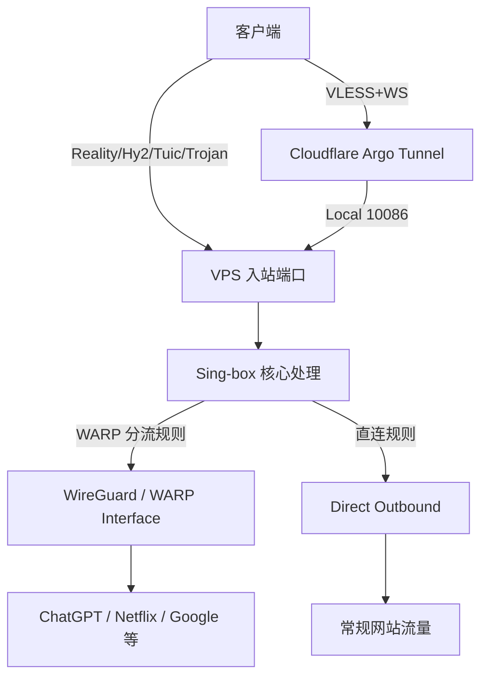

# 🚀 Sing-box 终极定制版 (sb-install)

<div align="center">


**无损原排版 | 交互主菜单 | 修复 Bug | 极限稳定**

[English](README_EN.md) • [简体中文](README.md)

</div>

---

## ⚡ 项目简介 (Introduction)

`sb-install` 是一个针对 [sing-box](https://github.com/SagerNet/sing-box) 核心深度定制的一键部署脚本。它专为追求极致网络体验的用户设计，支持目前最主流的代理协议（Reality, Hysteria2, TUIC 等），并内置 Cloudflare WARP 分流、IPv4/IPv6 双栈优选、动态端口跳跃（Port Hopping）以及全自动的交互式管理菜单。

### ✨ 核心特性

* **🛡️ 全协议支持**：VLESS-Reality, Hysteria2, TUIC v5, Trojan, AnyTLS, ShadowTLS, VLESS-Argo (WebSocket)。
* **☁️ 深度 WARP 集成**：内置 Cloudflare WARP (分流/全局模式)，附带自动化端口自愈与健康守护进程，有效应对风控与解锁流媒体。
* **🔀 高阶端口跳跃**：针对 Hysteria2 提供 Native Multi-port 端口跳跃支持，原生 iptables/nftables NAT 重定向，极大提升连接稳定性。
* **🌐 双栈无缝适配**：完美支持 IPv4 / IPv6 纯净环境及双栈 VPS，节点出口按需绑定。
* **🛠️ 交互式菜单**：输入 `sb` 即可随时调出管理菜单，一键查看配置、生成分享链接及 Mihomo (Clash) 订阅格式。
* **🚀 系统级调优**：自动开启 BBR、优化内核 TCP/UDP 缓冲区、全自动配置 UFW/Firewalld/iptables/nftables 防火墙。

---

## 📸 运行截图 (Screenshots & Demo)

<details>
<summary>点击展开查看脚本运行截图及自动化安装过程</summary>

*(提示：在此处上传你的图片到 GitHub issues 并替换下方链接)*

**交互式主菜单**


**自动化安装过程 (GIF)**


</details>

---

## 🧠 项目架构图 (Architecture)



---

## 💻 系统支持 (Supported Systems)

| 操作系统 | 版本要求 | 架构支持 | 状态 |
| :--- | :--- | :--- | :--- |
| **Debian** | 10, 11, 12+ | AMD64, ARM64 | ✅ 完美兼容 |
| **Ubuntu** | 20.04, 22.04, 24.04+ | AMD64, ARM64 | ✅ 完美兼容 |
| **CentOS / RHEL**| 7, 8, 9 (Stream) | AMD64, ARM64 | ✅ 完美兼容 |
| **Alpine Linux** | 3.18+ | AMD64, ARM64 | ✅ 支持 (OpenRC) |
| **Fedora** | 38, 39+ | AMD64, ARM64 | ✅ 支持 |

---

## 📦 安装指南 (Installation)

### 1. 前置准备 (Prerequisites)
在运行脚本之前，请确保您的服务器满足以下条件：
* 具有 `root` 权限。
* （可选）如果使用 ACME 申请证书，请提前将您的域名解析到服务器 IP。

更新系统并安装必要的下载工具：
```bash
# Debian / Ubuntu
apt update -y && apt install -y curl wget bash

# CentOS / Fedora
yum update -y && yum install -y curl wget bash

# Alpine
apk update && apk add curl wget bash
```

### 2. 一键安装命令 (One-click Install)
执行以下命令开始全自动交互式安装：

```bash
bash <(curl -fsSL [https://raw.githubusercontent.com/kzhx666/sb-install/main/install.sh](https://raw.githubusercontent.com/kzhx666/sb-install/main/install.sh))
```
*执行后，请根据屏幕上的提示选择您需要的配置（如出站模式、端口设置、域名证书选项等）。*

---

## 🕹️ 使用与管理 (Usage)

安装完成后，脚本会自动配置全局快捷命令。在任意目录下输入以下命令即可呼出管理菜单：

```bash
sb
```

**菜单功能包含：**
1. 全新安装 / 重新配置 (含 WARP, 跳跃, Argo 等)
2. 查看所有节点链接与配置 (含通用分享链接与 Mihomo YAML 格式)
3. 一键更新 Sing-box 核心至最新版
4. 彻底卸载脚本及所有服务

**服务状态管理：**
```bash
systemctl status sing-box    # 查看运行状态
systemctl restart sing-box   # 重启服务
systemctl stop sing-box      # 停止服务
journalctl -u sing-box -f    # 查看实时运行日志
```

---

## 📂 项目目录结构 (Directory Structure)

```text
/etc/sing-box/
├── config.json               # Sing-box 主配置文件
├── cert/                     # 证书存放目录
│   ├── cert.pem              # 域名证书或自签证书
│   └── key.pem               # 证书私钥
├── warp/                     # WARP 配置目录
│   ├── wgcf-account.toml     # WARP 账户信息
│   └── wgcf-profile.conf     # WireGuard 节点配置
├── mihomo_proxies.yaml       # 自动生成的 Mihomo (Clash) 节点配置
└── .sb_state                 # 脚本内部状态存储文件

/usr/local/bin/
├── sing-box                  # Sing-box 核心可执行文件
├── sb                        # 交互式菜单快捷命令
├── sb-hop.sh                 # 端口跳跃 NAT 路由处理脚本
└── sb-warp-watch.sh          # WARP 接口自愈守护脚本
```

---

## ❓ 常见问题 (FAQ)

<details>
<summary><b>1. 为什么安装后节点无法连通？</b></summary>
请检查您的服务器提供商（如阿里云、腾讯云、AWS 等）的网页端控制台安全组，确保脚本分配的端口（TCP/UDP）已放行。脚本虽自动放行了本机防火墙，但无法跨过服务商的外部安全组。
</details>

<details>
<summary><b>2. WARP 分流是什么？我需要开启吗？</b></summary>
WARP 分流可将特定的流量（如 ChatGPT、Netflix 等流媒体或被频繁风控的 AI 网站）通过 Cloudflare 的网络代理出去，从而隐藏你真实的 VPS IP，降低被封禁或遇到验证码的概率。推荐选择 <code>split</code> 模式开启。
</details>

<details>
<summary><b>3. 如何配置 Hysteria2 端口跳跃？</b></summary>
在安装过程中，当提示输入跳跃范围时，输入类似于 <code>30000-31000</code> 的格式即可。脚本会自动处理底层的 iptables/nftables NAT 转发。客户端在 <code>mport</code> 处填写相同范围即可。
</details>

<details>
<summary><b>4. 如何彻底卸载？</b></summary>
在命令行输入 <code>sb</code> 调出菜单，选择 `4. 彻底卸载脚本及所有服务`，或者直接运行 <code>bash install.sh --uninstall</code> 即可无残留清理。
</details>

---

## 📊 Star History

[](https://star-history.com/#kzhx666/sb-install&Date)

---

## 📜 声明与协议 (License)

* 本项目仅供学习交流使用，请勿用于非法用途。
* 本项目基于 [MIT License](LICENSE) 发行。
* 核心底层依赖 [Sing-box](https://github.com/SagerNet/sing-box)。

**如果您觉得这个项目对您有帮助，请点个 ⭐ Star 支持一下！**
