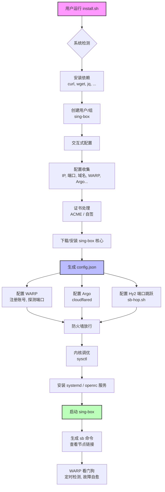

# 🚀 Sing-box 终极定制安装脚本

[](https://github.com/kzhx666/sb-install/releases)
[](https://github.com/kzhx666/sb-install/stargazers)
[](https://github.com/kzhx666/sb-install/blob/main/LICENSE)
[](https://github.com/kzhx666/sb-install/releases)
[](https://www.gnu.org/software/bash/)
[](https://github.com/SagerNet/sing-box)

---

> **一键部署全协议代理服务，集成 WARP 分流、端口跳跃、Argo 隧道，支持 IPv4/IPv6 双栈，适配所有主流 Linux 发行版。**

📌 **项目地址**： [https://github.com/kzhx666/sb-install](https://github.com/kzhx666/sb-install)

---

## 📖 目录

- [✨ 特性](#-特性)
- [🖥️ 系统支持](#️-系统支持)
- [⚡ 快速安装](#-快速安装)
  - [前置要求](#前置要求)
  - [一键安装命令](#一键安装命令)
  - [卸载](#卸载)
- [📦 项目结构](#-项目结构)
- [🧠 项目架构图](#-项目架构图)
- [🚀 功能展示](#-功能展示)
  - [支持的代理协议](#支持的代理协议)
  - [WARP 智能分流](#warp-智能分流)
  - [Hy2 端口跳跃](#hy2-端口跳跃)
  - [双栈部署](#双栈部署)
- [🛠️ 使用指南](#️-使用指南)
  - [查看节点链接](#查看节点链接)
  - [服务管理](#服务管理)
  - [重新配置](#重新配置)
  - [手动更新核心](#手动更新核心)
- [❓ FAQ](#-faq)
- [📸 演示截图](#-演示截图)
- [📊 Star 历史](#-star-历史)
- [📌 版本说明](#-版本说明)
- [🤝 贡献](#-贡献)
- [📄 许可证](#-许可证)

---

## ✨ 特性

- ✅ **全协议支持**：VLESS Reality、Hysteria2、Tuic、AnyTLS、ShadowTLS、Trojan，一键生成所有节点。
- ✅ **WARP 智能分流**：自动注册 WARP 账号，为 AI / 流媒体网站分流，解决 IP 风控。
- ✅ **端口跳跃 (Hy2)**：原生 UDP 端口跳跃，支持 nftables/iptables REDIRECT 或 socat 降级，稳定不掉线。
- ✅ **Argo 隧道**：一键配置 Cloudflare Argo 隧道，无需域名即可使用 CDN。
- ✅ **双栈支持**：IPv4 / IPv6 独立监听，节点输出可选择 v4/v6 或双栈。
- ✅ **自动 HTTPS**：支持 ACME 自动申请证书（DNS / Standalone）或生成自签证书。
- ✅ **智能防火墙**：自动放行所需端口，兼容 ufw / firewalld / iptables / nftables。
- ✅ **性能调优**：自动优化系统内核参数（BBR、缓冲区等）。
- ✅ **故障自愈**：WARP 端口失效时自动轮换入口和端口，保证服务高可用。
- ✅ **管理脚本**：安装后使用 `sb` 命令查看所有节点链接和 Mihomo 格式配置。

---

## 🖥️ 系统支持

| 发行版       | 版本要求          | 架构                | 包管理器 |
|--------------|-------------------|---------------------|----------|
| Ubuntu       | 18.04 / 20.04 / 22.04 / 24.04 | amd64, arm64        | apt      |
| Debian       | 10 / 11 / 12      | amd64, arm64        | apt      |
| CentOS       | 7 / 8 / 9         | amd64, arm64        | yum / dnf |
| Rocky Linux  | 8 / 9             | amd64, arm64        | dnf      |
| AlmaLinux    | 8 / 9             | amd64, arm64        | dnf      |
| Fedora       | 38 / 39 / 40      | amd64, arm64        | dnf      |
| Alpine       | 3.16+             | amd64, arm64, armv7 | apk      |
| Arch Linux   | 最新              | amd64, arm64        | pacman (需手动安装依赖) |

> 💡 **注意**：脚本会自动检测系统并安装必要依赖，建议使用 **root** 用户执行。

---

## ⚡ 快速安装

### 前置要求

1. **root 权限**：必须以 `root` 用户运行（使用 `sudo -i` 或直接登录 root）。
2. **网络连通**：服务器需能正常访问 GitHub 和 Cloudflare（用于下载和 WARP 注册）。
3. **基础工具**：脚本会自动安装 `curl`、`wget`、`jq` 等依赖，但若系统极度精简（如 Docker 容器），建议先手动安装：

   ```bash
   # Debian/Ubuntu
   apt update && apt install -y curl wget

   # CentOS/Rocky/Alma
   yum install -y curl wget

   # Alpine
   apk add curl wget bash
   ```

### 一键安装命令

```bash
curl -fsSL https://raw.githubusercontent.com/kzhx666/sb-install/main/install.sh -o install.sh && bash install.sh
```

或使用 wget：

```bash
wget -qO install.sh https://raw.githubusercontent.com/kzhx666/sb-install/main/install.sh && bash install.sh
```

> 安装过程中会交互式询问配置，全部默认即可快速部署。  
> **⚡ 自动安装演示 GIF**  
>   
> *(实际演示图请替换为真实截图或 GIF)*

### 卸载

```bash
bash install.sh --uninstall
```

---

## 📦 项目结构

安装完成后，项目文件分布如下：

```
/etc/sing-box/
├── config.json           # 主配置文件
├── .sb_state              # 状态文件（记录 IP、端口、密钥等）
├── cert/                  # 证书目录
│   ├── cert.pem
│   └── key.pem
├── warp/                  # WARP 配置文件
│   ├── wgcf-account.toml
│   └── wgcf-profile.conf
└── mihomo_proxies.yaml    # 生成的 Mihomo 格式节点配置

/usr/local/bin/
├── sing-box               # sing-box 主程序
├── sb                     # 快捷管理脚本（查看节点）
├── sb-hop.sh              # Hy2 端口跳跃脚本
├── sb-warp-watch.sh       # WARP 自愈看门狗
└── sb-selfcheck.sh        # 自检脚本

/etc/systemd/system/
├── sing-box.service       # sing-box 系统服务
├── sb-warp-watch.service  # WARP 看门狗服务
└── sb-warp-watch.timer    # 定时器（每120秒触发）
```

---

## 🧠 项目架构图



---

## 🚀 功能展示

### 支持的代理协议

| 协议          | 传输层 | 加密/认证                          |
|---------------|--------|-------------------------------------|
| VLESS Reality | TCP    | uTLS / Reality                      |
| Hysteria2     | UDP    | TLS + 密码                          |
| Tuic          | UDP    | TLS + UUID + 密码                   |
| AnyTLS        | TCP    | TLS + 密码                          |
| ShadowTLS     | TCP    | Shadowsocks + ShadowTLS 混淆        |
| Trojan        | TCP    | TLS + 密码                          |
| Argo (VLESS+WS)| TCP   | TLS + WebSocket + Cloudflare 隧道   |

### WARP 智能分流

- 自动注册 WARP 账号
- 为 AI / 流媒体（如 ChatGPT、Claude、Gemini、Netflix、Disney+ 等）域名走 WARP 出口
- 支持两种模式：
  - **split**：仅指定域名走 WARP
  - **all**：所有流量走 WARP（需谨慎）
- 故障自动切换入口和端口

### Hy2 端口跳跃

- 支持 IPv4 / IPv6 独立跳跃范围
- 优先使用 nftables / iptables REDIRECT，性能最高
- 降级方案：socat 端口转发
- 与服务同生共死，重启自动生效

### 双栈部署

- 可单独输出 IPv4 或 IPv6 节点
- 双栈 VPS 可同时输出两个独立节点组（v4/v6 不同端口）
- 自动绑定对应 IP 出站，避免 IPv6 节点却走 IPv4 出口

---

## 🛠️ 使用指南

### 查看节点链接

安装完成后，直接运行 `sb` 命令即可显示所有协议链接（sing-box 格式）和 Mihomo 格式配置。

```bash
sb
```

输出示例：

```
vless://uuid@1.2.3.4:443?encryption=none&flow=xtls-rprx-vision&security=reality&... # Reality
hysteria2://password@1.2.3.4:8443?insecure=1&sni=www.bing.com # Hy2
...
========== Mihomo Proxies YAML ==========
- name: "SB_Reality"
  type: vless
  server: "1.2.3.4"
  ...
```

### 服务管理

```bash
systemctl status sing-box          # 查看服务状态
systemctl restart sing-box          # 重启
journalctl -u sing-box -f           # 实时日志
```

### 重新配置

如需更改配置（如更换域名、开启 WARP、修改端口等），只需重新运行安装脚本：

```bash
bash install.sh
```

脚本会保留已有密钥（UUID、密码等）并更新配置。

### 手动更新核心

```bash
bash install.sh
# 在主菜单中选择 3) 一键更新 Sing-box 核心至最新版
```

---

## ❓ FAQ

### Q1: 安装后节点无法连接怎么办？

1. **检查防火墙**：确保脚本已放行端口（iptables -L -n -v | grep 端口）。如果使用云服务商，还需在安全组中放行对应端口。
2. **检查服务状态**：`systemctl status sing-box` 查看是否正常运行。
3. **查看日志**：`journalctl -u sing-box -f` 观察有无明显错误。
4. **检查证书**：如果使用自签证书，客户端需开启 `allowInsecure`（脚本已自动处理）。

### Q2: WARP 无法连接 / 所有节点都走 WARP 了？

- 检查 WARP 模式设置：脚本会询问使用 split 还是 all，默认为 split。如需修改，重新运行脚本并选择 0 禁用或 1 启用并选择模式。
- WARP 端口可能被运营商封锁，脚本会自动探测可用入口和端口，若全部失败则降级为不启用 WARP。
- 可手动调整环境变量：`export WARP_INGRESS_CANDIDATES="ip1 ip2"` 后重新运行脚本。

### Q3: 端口跳跃不生效？

- 脚本默认使用 nftables/iptables REDIRECT，需确认内核支持 NAT。
- 若系统不支持，会降级为 socat 转发（性能稍差）。可通过 `ps aux | grep socat` 确认。
- 检查跳跃范围是否正确，客户端需配置相同的端口范围。

### Q4: 如何更新证书？

- 如果使用 ACME 申请的证书，acme.sh 会自动续期，并重启 sing-box。
- 如果使用自签证书，证书有效期为10年，无需更新。

### Q5: 支持 IPv6 only 的 VPS 吗？

- 支持！脚本会自动检测并适配。在配置双栈时选择“仅输出 IPv6”即可。

---

## 📸 演示截图

> 以下为占位截图，实际部署时可替换为真实截图。

| 安装过程 | sb 命令输出 | Mihomo 配置 |
|----------|-------------|-------------|
|  |  |  |

---

## 📊 Star 历史

[](https://star-history.com/#kzhx666/sb-install&Date)

---

## 📌 版本说明

### 格式：`v<主版本>.<功能版本>.<修订号>`

- **主版本**：重大架构变更，不兼容升级
- **功能版本**：新增协议、功能模块
- **修订号**：Bug 修复、小优化

### 当前版本：v6.5

- 重构 WARP 注册与探测逻辑，增加故障自愈
- 修复双栈模式下 IPv6 出口绑定问题
- 优化端口跳跃规则，避免定时任务导致规则清空
- 增加多种协议兼容性配置

[查看全部发布记录](https://github.com/kzhx666/sb-install/releases)

---

## 🤝 贡献

欢迎任何形式的贡献！你可以：

- 提交 Issue 报告 Bug 或建议新功能
- 提交 Pull Request 改进代码或文档
- 在 GitHub 上点亮 Star ⭐ 支持本项目

### 开发环境

- 脚本使用 Bash 编写，遵循 ShellCheck 规范。
- 主要逻辑集中在 `install.sh`，模块化函数清晰。
- 提交前请确保脚本通过 `shellcheck` 检查。

---

## 📄 许可证

本项目采用 [GNU General Public License v3.0](https://github.com/kzhx666/sb-install/blob/main/LICENSE) 开源许可证。

---

> 💡 **提示**：本脚本仅供学习交流使用，请遵守当地法律法规，合理使用代理服务。

---

**✨ 一键部署，畅享高速代理！**  
**如果觉得好用，请给个 Star 吧！** ⭐
